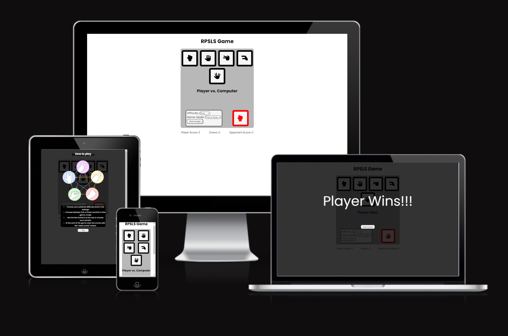

# RPSLS Game

The RPSLS Game is a web application variant of the game "Rock, Paper, Scissors, Lizard, Spock". Target audience are people that want to play a simple online game based on chance. The Game gives the player the opportunity to play against the computer with two difficulty options as well as two game-modes.

## Features

### Game-Area
- The game-area features the different elements that are required to play the game.

#### Player-area
- The player-area consists of five buttons that the player uses to choose his symbol for the next round. They are in order rock, paper, scissors, lizard and spock.
- Hovering or clicking a button will turn it blue to indicate which symbol was chosen.

#### Round winner indicator
- The round winner indicator tells the player who won the last round or if it's a draw.

#### Computer Icon
- The computer icon show the symbol chosen by the computer in the last round.

#### Settings
- The settings give the player the opportunity to choose either easy or difficult as the computers difficulty setting.
- It also features two game-modes. "First to three" and "First to five".
- There is a "How to play" button in the setttings-area that opens up a modal. The modal shows a picture that tells the player which symbol beats which symbol.

### Score-Area
- The score-area shows the player the current score of the game.

### Winning Screen
- The winning screen appears when either the player or the computer reach the maximum score and win the game.

## Testing

### Manual Testing
- During testing, I used four different browsers to ensure cross-compatibility. The browsers used were:
    1. Firefox
    2. Chrome
    3. Edge
    4. Opera

- I used the devtools to simulate different screen sizes/devices from 200 px up to 2000px in width.

### Validators

***HTML***

- Using the W3C markup validation service, no issues were found in the html code

***CSS***

- Using the W3C CSS validation service, no issues were found in the CSS file

    

***Javascript***

- Using [jshint](https://jshint.com) two main issues were found
1. **Issue**: several semi-colons were missing
    - **Solution**: I added semi-colons where they were missing
2. **Issue**: Functions declared within loops referencing an outer scoped variable may lead to confusing semantics. (runGame, closeWinScrn)
    - **Solution**: This was fixed by taking the concerned functions that were referencing the outer scoped variable out of the event listener loop.

### Lighthouse scores

- the accessibility score was at 88 in the beginning because I forgot to add aria-labels to the buttons without text as well as some buttons were too small for touchscreen use.
- the SEO score started out at 90 as the meta description and keywords were missing

#### Desktop

#### Mobile

### Wave
- In addition I used the web accessibility evaluation tool (WAVE) and two contrast errors were found.
    - one error was solved by changing the colors of the affected text.
    - the second error concerned text that is supposed to be unreadable so I ignored it.

## Deployment
- The site was deployed to GitHub pages. The following steps were needed:
    1. From the project's repository, go to the Settings tab.
    2. On the left, go to the Pages tab.
    3. Under Branch, choose main from the drop-down menu.
    4. Click save and refresh the page
    5. On the top of the pages tab, it shows successful deployment.

## Credits

### General
- The project was influenced by the Code Institutes code along project called Love maths. I tried to deviate from the code as much as possible. Nevertheless there may be similarities.
- I used W3schools, MDN web docs and the Code Inistitute HTML, CSS and Javacript essentials content as general reference.

### Content
- All icons used for the buttons are taken from [FontAwesome](https://fontawesome.com/)

### Media
- The how to play image was taken from [bigbangtheory.fandom.com](https://bigbangtheory.fandom.com/wiki/Rock,_Paper,_Scissors,_Lizard,_Spock)
- The favicon was generated using the how to play image with [favicon.io](https://favicon.io/favicon-converter/)

### Special Thanks
- to my mentor David Bowers for his useful help, hints and tips.