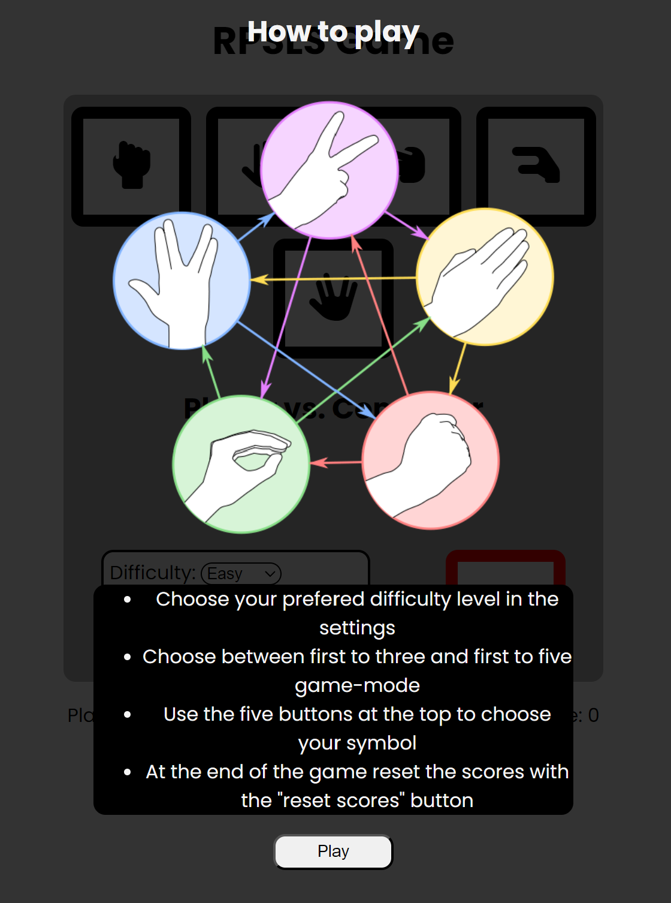

# RPSLS Game

The RPSLS Game is a web application variant of the game "Rock, Paper, Scissors, Lizard, Spock". Target audience are people that want to play a simple online game based on chance. The Game gives the player the opportunity to play against the computer with two difficulty options as well as two game-modes.

## Features

### Game-Area
- The game-area features the different elements that are required to play the game.

#### Player-area
- The player-area consists of five buttons that the player uses to choose his symbol for the next round. They are in order rock, paper, scissors, lizard and spock.
- Hovering or clicking a button will turn it blue to indicate which symbol was chosen.

#### Round winner indicator
- The round winner indicator tells the player who won the last round or if it's a draw.

#### Computer Icon
- The computer icon show the symbol chosen by the computer in the last round.

#### Settings
- The settings give the player the opportunity to choose either easy or difficult as the computers difficulty setting.
- It also features two game-modes. "First to three" and "First to five".
- There is a "How to play" button in the setttings-area that opens up a modal. The modal shows a picture that tells the player which symbol beats which symbol.

### Score-Area
- The score-area shows the player the current score of the game.

### Winning Screen
- The winning screen appears when either the player or the computer reach the maximum score and win the game.

